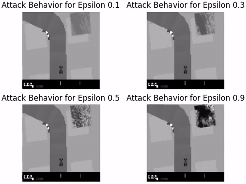

## Abstract

Recent studies demonstrated the vulnerability of control policies learned through deep reinforcement learning against adversarial attacks, raising concerns about the application of such models to risk-sensitive tasks such as autonomous driving. Threat models for these demonstrations are limited to (1) targeted attacks through real-time manipulation of the agent's observation, and (2) untargeted attacks through manipulation of the physical environment. The former assumes full access to the agent's states/observations at all times, while the latter has no control over attack outcomes. This paper investigates the feasibility of targeted attacks through visually learned patterns placed on physical objects in the environment, a threat model that combines the practicality and effectiveness of the existing ones. Through analysis, we demonstrate that a pre-trained policy can be hijacked within a time window, e.g., performing an unintended self-parking, when an adversarial object is present. To enable the attack, we adopt an assumption that the dynamics of both the environment and the agent can be learned by the attacker. Lastly, we empirically show the effectiveness of the proposed attack on different driving scenarios, perform a location robustness test, and study the tradeoff between the attack strength and its effectiveness.

## Approach

* Our attack algorithm generates a **static perturbation** using a trained dynamics model that can be directly realized through an object placed in the environment to mislead the agent towards a pre-specified state within a time window.
* We conduct experiments with **3 driving scenarios** and compared our approach with baselines to show the effectiveness of our attack.
* We study the **robustness of the derived attacks** with respect to their relative locations to the agent, and show that moving the attack object partially out of the sight of the agent will reduce the attack effect.


## Results

* OpenAI Gym's <a href="https://gym.openai.com/envs/CarRacing-v0/" target="_blank">CarRacing-v0</a> environment – continuous state and action spaces.
* Pretrained policy with Actor-Critic algorithm.
* Dynamics model with Variational Auto Encoder and Mixture Density Recurrent Neural Networks.

#### Target States
We set target states to be outside of track for all 3 scenarios as shown in second row of below image.


#### Straight Track
<div style="text-align: center;"></div>

#### Left Turn Track
<div style="text-align: center;"></div>

#### Right Turn Track
<div style="text-align: center;"></div>

#### Variable Adversarial Bound
##### Straight Track
<div style="text-align: center;"></div>

##### Left Turn Track
<div style="text-align: center;"></div>

##### Right Turn Track
<div style="text-align: center;"></div>

## Acknowledgements
<div display="inline-block" style="text-align: center;">
  
  
  
  
  
</div>

## Citation
Please cite our paper if it is used in your research.
```
@article{buddareddygari2021targeted,
      title={Targeted Attack on Deep RL-based Autonomous Driving with Learned Visual Patterns},
      author={Prasanth Buddareddygari and Travis Zhang and Yezhou Yang and Yi Ren},
      year={2021},
      journal={arXiv preprint arXiv:2109.07723}
}
```
